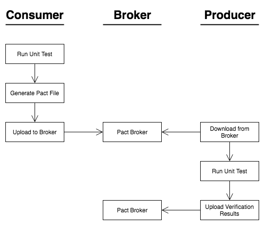

# Consumer driven contract with PACT-NODE



### On the consumer:

- Write unit tests specifying the request and the response shape
- Run the tests, which, if successful, generate a Pact file
- Upload the Pact file to the broker

### On the producer:

- Download the Pact files that involve the producer
- Run the tests, which, if successful, generate verification results
- Upload the verification results to the broker

## Install

Clone the repo

From the root folder run:

```bash
docker-compose up -d
```

OR

Build and spin up

```bash
docker-compose up -d --build
```

This will start the following

- Provider on port 3000
- Consumer on port 3050
- Pact Broker on port 3080

## Usage

### The contract:

The consumer expects the following schema @ the provider endpoint : ~/users

```bash
[{
  firstName, lastName, email
}]
```

### Test consumer

```bash
npm run test:pact:consumer
```

### Test provider

```bash
pm run test:pact:provider
```

## Testing the pact

### Simulate consumer failure (break consumer contract)

- Change the service url to <b>~/users/all</b> instead of <b>~/users</b>
- Run the consumer test
  ```bash
  npm run test:pact:consumer
  ```
- The consumer tests should break indicating break in contract

### Simulate provider faulure (break provider contract)

Pre requisite: Make sure the pact broker is up and pact files are published

- From root folder run
  ```bash
  docker-compose up -d
  ```
- From the client folder run
  ```bash
  npm run test:pact:consumer
  ```
- Change the getUsers function to return email as a property of "contact" object
  ```bash
  [{
    firstName, lastName, contact : {email, phone}
  }]
  ```
- Update <b>createUser</b> function in <b>pact-user-setup</b> endpoint in handler.js

- Rebuild docker image and deploy

  ```bash
  docker-compose up -d --build pact-provider-app
  ```

- Run the provider test

  ```bash
  npm run test:pact:provider
  ```

- The provider tests should break indicating break in contract

### Change consumer contract

- Say that the consumer needs phone number from the UserService, like so
  ```bash
  [{
    firstName, lastName, contact : {email, phone}
  }]
  ```
- Update the interactions.js to reflect new expected contract
- Run the test and publish new pact files to broker
  ```bash
  npm run test:pact:consumer
  ```
- Notify the server build and run the server test
  ```bash
  npm run test:pact:provider
  ```
- The provider tests should break indicating break in contract.
- The provider now needs to be updated with updated contract.
- Run provider test again to see a green build
